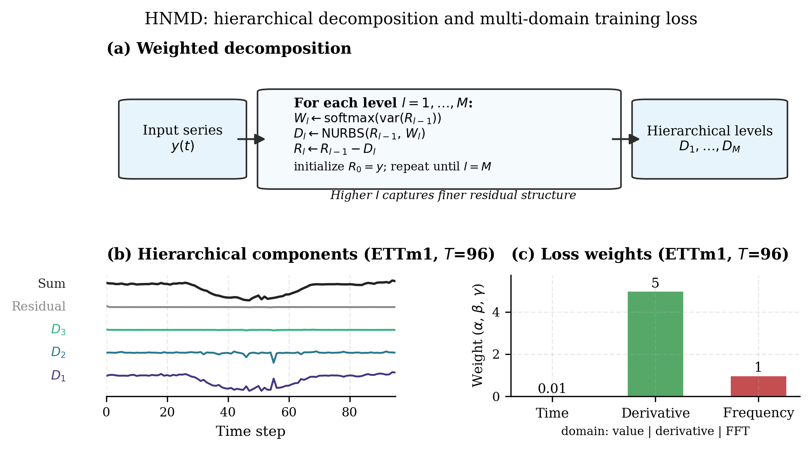
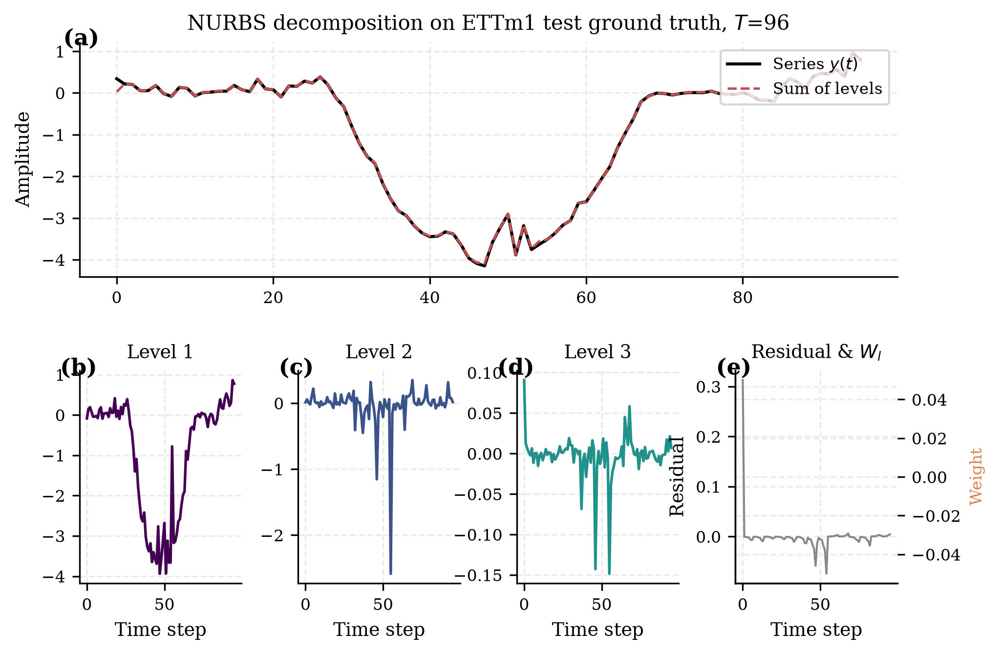
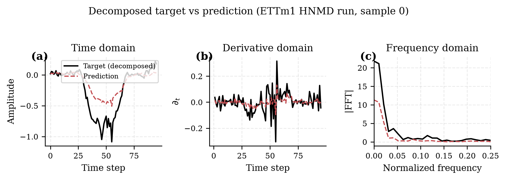
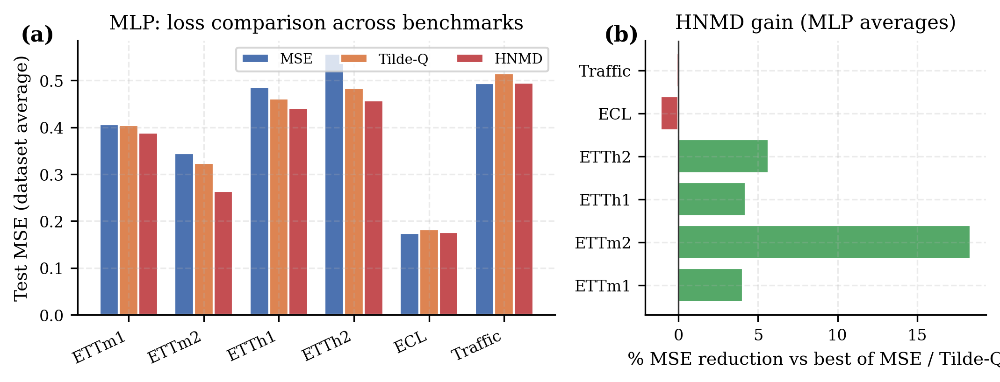
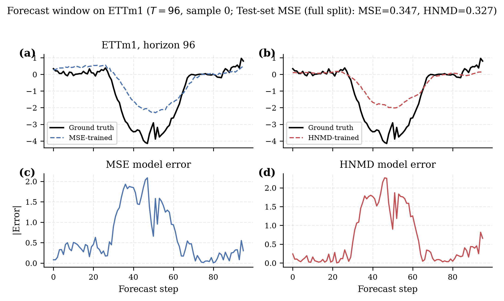

# Hierarchical NURBS-Inspired Multi-Domain Loss (HNMD)

**Authors:** Jason Abohwo, Srikara Vishnubhatla — Yale University

Official implementation and benchmark code for **HNMD** (also referred to as **MSSD** in this repository via the `--loss mssd` flag): a training objective for deep time-series forecasting that supervises hierarchical spline structure in the time, derivative, and frequency domains.

Paper source: [`paper/main.tex`](paper/main.tex) *(draft / ongoing)*

---

## Overview

Standard forecasting losses such as MSE and MAE penalize point-wise error but often under-emphasize periodic structure, local shape, and spectral content. **HNMD** addresses this by:

1. **Complexity-based decomposition** — iteratively approximating a series with function approximators of increasing capacity, peeling off coarse structure before finer residuals.
2. **Weighted spline decomposition** — applying region-conditioned NURBS-style basis splines, where weights come from regional criteria (e.g. sliding-window variance) rather than being fully optimized at fit time.
3. **Multi-domain supervision** — comparing decomposed predictions and targets in the **time**, **derivative**, and **frequency** (FFT) domains, with level-wise gradient weighting during the backward pass.

Compared with shape-focused objectives such as DILATE and Tilde-Q, HNMD explicitly supervises multi-scale structure through the decomposition hierarchy rather than relying on point-wise or warp-based comparison alone.

We study HNMD as a **training objective for a fixed 3-layer MLP** on multivariate long-horizon benchmarks. Architecture and optimization are held constant so that differences reflect the loss, not model design.



*The input series is decomposed into hierarchical weighted spline components; the resulting representation is supervised across time, derivative, and frequency domains.*

---

## Method

### Complexity-based decomposition

Given a time series y(t), we decompose it into m components of increasing complexity:

```
y(t) = f̂₁(t) + f̂₂(t) + … + f̂ₘ(t) + Rₘ(t)
```

Each level fits the **residual** left by previous levels. When the number of levels and approximator capacities match the underlying factors, the hierarchy separates distinct temporal dynamics; in practice, levels group related structure across scales.

### Weighted spline decomposition

At each hierarchy level l = 1, …, M (while residual variance exceeds a threshold ε):

- Build a knot vector **k**ₗ and regional weights **W**ₗ = W(Rₗ₋₁, c) from the current residual.
- Compute NURBS basis functions **N**ₗ(t).
- Fit coefficients **C**ₗ = (**N**ₗᵀ**N**ₗ)⁻¹**N**ₗᵀ Rₗ₋₁, then update the level component and residual.

Implementation: [`utils/mssd.py`](utils/mssd.py).

### Level-weighted multi-domain error

Given predicted and target series, apply the same decomposition S(·) to both, then:

```
Error = α · (s_pred* − s_true*) + β · (s_pred′ − s_true′) + γ · (FFT(s_pred*) − FFT(s_true*))
```

where * denotes normalization, ′ is the time derivative, and α, β, γ are domain weights. During backprop, per-level gradients are scaled by level importance derived from (y_pred − y_true)^x.

Domain ablations: set `--alpha 0`, `--beta 0`, or `--gamma 0`. Hierarchy depth: `--max_levels`.

---

## Qualitative examples

These two diagnostics explain **how HNMD represents and supervises** time series—not the benchmark scores ([Results](#results-detail) below).

**Weighted spline decomposition (ETTm1, horizon 96).** The hierarchy reconstructs the target (top) while separating low-frequency trajectory from finer residuals (lower panels).



**Multi-domain target–prediction comparison.** A forecast can align in the time domain while still mismatching local slope or spectral content; HNMD optimizes all three views.



Regenerate from `./results/` with `python paper/generate_figures.py` (see [`paper/figures/README.md`](paper/figures/README.md)).

---

## Results (detail)

**Setup:** look-back 96; prediction lengths {96, 192, 336, 720}; Adam lr 1e-3; test metrics **MSE** and **MAE**. HNMD hyperparameters (α, β, γ) and knot settings are tuned per dataset and horizon (Appendix table / [`filltables.py`](filltables.py)).

**Primary comparison:** fixed 3-layer MLP trained with **MSE**, **Tilde-Q**, or **HNMD** on ETTh1, ETTh2, ECL, Traffic, and Weather. Gains are largest on the **hourly ETT** datasets; improvements on ECL, Traffic, and Weather are smaller and sometimes horizon-dependent.

### Table 1 — MLP long-horizon forecasting (varying training loss)

Long-horizon forecasting with a **fixed 3-layer MLP** and varying training loss. Input length is **96**; prediction lengths are **{96, 192, 336, 720}**. Each entry is the **mean test metric over all four horizons**. **Bold** marks the best MSE/MAE pair among {MSE, Tilde-Q, HNMD} for that dataset. **—** denotes a dataset–loss setting not yet complete across all four horizons. **Wins** counts completed dataset-average MSE/MAE pairs won by each loss.

| Training Loss | ETTh1 MSE | ETTh1 MAE | ETTh2 MSE | ETTh2 MAE | ECL MSE | ECL MAE | Traffic MSE | Traffic MAE | Weather MSE | Weather MAE | Wins |
|:--------------|----------:|----------:|----------:|----------:|--------:|--------:|------------:|------------:|------------:|------------:|-----:|
| MSE           | 0.487     | 0.475     | 0.557     | 0.491     | —       | —       | —           | —           | —           | —           | 0    |
| Tilde-Q       | 0.461     | 0.450     | 0.485     | 0.450     | —       | —       | —           | —           | —           | —           | 0    |
| **HNMD**      | **0.442** | **0.441** | **0.457** | **0.439** | —       | —       | —           | —           | —           | —           | **4** |

On the completed ETTh1 and ETTh2 averages, HNMD wins all four MSE/MAE pairs (Wins = 4). ECL, Traffic, and Weather rows are pending full MSE/Tilde-Q/HNMD coverage across all horizons.

### Additional MLP averages (HNMD vs Tilde-Q, from completed runs)

Extended results from other datasets and horizons in the appendix (15-minute ETT benchmarks and additional completed MLP runs):

| Dataset | HNMD MSE | Tilde-Q MSE | HNMD MAE | Tilde-Q MAE |
|---------|----------|-------------|----------|-------------|
| ETTm1   | 0.383    | 0.402       | 0.395    | 0.409       |
| ETTm2   | 0.299    | 0.314       | 0.340    | 0.346       |
| ETTh1   | 0.437    | 0.462       | 0.437    | 0.451       |
| ETTh2   | 0.456    | 0.499       | 0.440    | 0.456       |
| ECL     | 0.196    | 0.198       | 0.281    | 0.284       |
| Traffic | 0.520    | 0.542       | 0.316    | 0.327       |



**Forecast example (ETTm1, horizon 96).** MSE-trained vs HNMD-trained MLP on the same architecture—the HNMD model better preserves the central trough and recovery pattern:



Full per-horizon tables, additional architectures (SOFTS, DLinear, Autoformer, …), and cited external baselines (PatchTST, TiDE, Time-LLM, …) are in the paper appendix and in `tables/filled_tables.xlsx` after running `filltables.py`. PatchTST/TiDE/Time-LLM numbers in the paper are **reported baselines** unless explicitly reproduced in this repo.

---

## Repository

This repo is a **reproducible benchmark pipeline**: config-driven experiment runner, fault-tolerant training (checkpoint / resume), optional [Modal](https://modal.com) GPU workers, and automated aggregation into paper tables and figures.

### Setup

```bash
python3 -m venv .venv
source .venv/bin/activate
pip install -r requirements.txt
```

**Device selection** (when `--use_gpu` is enabled, default): CUDA → MPS (Apple Silicon) → CPU. Mixed precision (`--use_amp`) is CUDA-only.

Place datasets under `./data/`:

```
data/
  ETT-small/          # ETTm1.csv, ETTm2.csv, ETTh1.csv, ETTh2.csv
  electricity/        # electricity.csv
  exchange_rate/      # exchange_rate.csv
  weather/            # weather.csv
  traffic/            # traffic.csv
  Solar/              # solar_AL.txt
```

See [scripts/multivariate_forecasting/README.md](scripts/multivariate_forecasting/README.md) for download links.

### Quick start

```bash
# Preview commands (no training)
python run_experiments.py --models MLP --datasets all --losses mssd --dry_run

# Tuned HNMD for MLP on all 9 datasets
python run_experiments.py --models MLP --datasets all --losses mssd

# Cross-loss comparison (MLP, 3 seeds)
python run_experiments.py --models MLP --datasets all --losses mssd mse tildeq --seeds 2024 --itr 3
```

### Single run

```bash
python run.py \
  --is_training 1 \
  --root_path ./data/ETT-small/ \
  --data_path ETTm1.csv \
  --model_id ETTm1_96_MLP \
  --model MLP \
  --data ETTm1 \
  --features M \
  --freq t \
  --seq_len 96 \
  --pred_len 96 \
  --enc_in 7 --dec_in 7 --c_out 7 \
  --d_model 256 --d_ff 512 \
  --loss mssd \
  --alpha 0.01 --beta 5 --gamma 1 \
  --knot_multiplier 5 --spline_criterion_exponent 1 \
  --seed 2024 --itr 1
```

Outputs: `./results/<setting>/metrics.npy`, `pred.npy`, `true.npy`.

### Stop and resume

| Situation | Re-run behavior |
|-----------|-----------------|
| Finished (`metrics.npy` exists) | Skipped (`--skip_if_done`, default) |
| Stopped mid-training | Resumes from `training_state.pth` |
| Training done, test missing | Test only (`--recover`, default) |

Force a full retrain: `--no-skip_if_done --no-resume`.

### Experiment drivers

| Script | Purpose |
|--------|---------|
| `run_experiments.py` | Main CLI — models, datasets, losses, seeds |
| `filltables.py` | Build paper Tables 2–4 → `tables/filled_tables.xlsx` |
| `paper/generate_tables.py` | LaTeX tables from `./results/` |
| `paper/generate_figures.py` | Regenerate all paper figures |
| `modal_app.py` | Run missing jobs on Modal GPU workers |
| `modal_setup.sh` | Upload/download artifact volumes |

Shell shortcuts: `scripts/hnmd/`.

**Modal (optional):**

```bash
./modal_setup.sh upload
modal run modal_app.py --parallel 4 --gpu L4
```

### Supported models

`MLP`, `DLinear`, `SOFTS`, `iTransformer`, `iInformer`, `iReformer`, `iFlowformer`, `iFlashformer`, `Autoformer`, `NLinear`

### Supported losses

| Flag | Description |
|------|-------------|
| `mse` | Mean squared error |
| `mssd` | HNMD / MSSD multi-domain loss |
| `tildeq` | Tilde-Q loss |

MSSD hyperparameters for MLP and DLinear load from bundled Excel tables (`HNMV_*_optimized.xlsx`), with Solar fallbacks.

### Build paper PDF

```bash
python filltables.py --no-run_missing
python paper/generate_tables.py
python paper/generate_figures.py
cd paper && pdflatex main.tex && bibtex main && pdflatex main.tex
```

Abstract win-counts and generated tables are **auto-derived from `./results/`**, not hand-edited.
